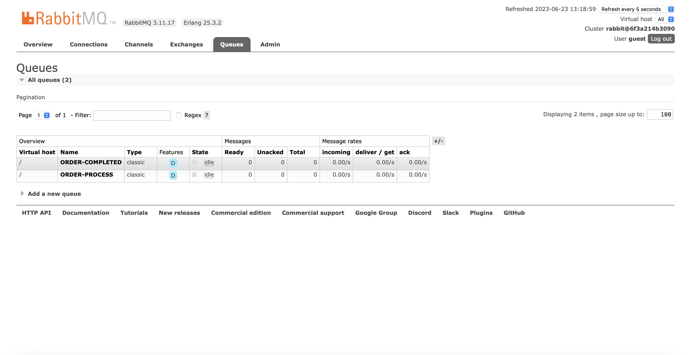
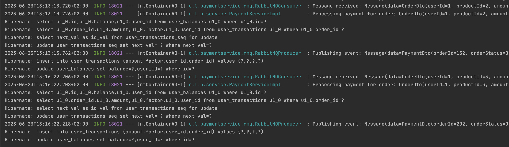
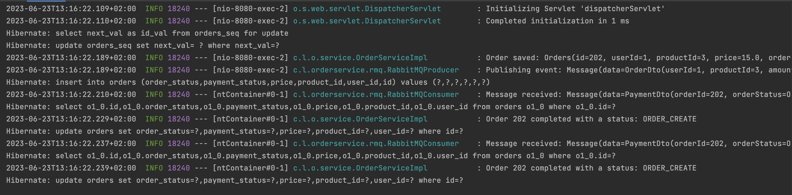
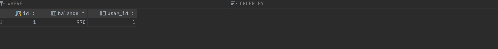
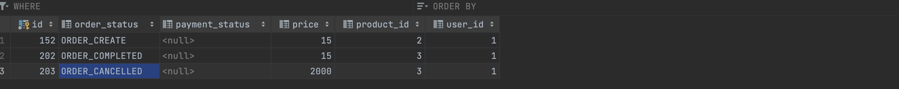
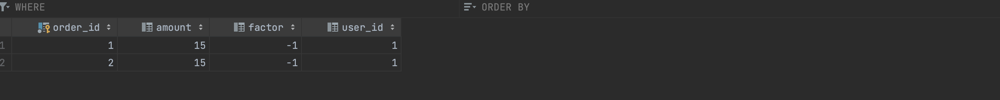

# Microservice Saga Choreography Implementation
Project contains implementation of microservice pattern, Saga Choreography, written
in Java Springboot.

## Technologies used
- Java 17
- Springboot
- Docker, Docker Compose
- RabbitMQ
- MYSQL

## How it works?
Explanation: https://www.baeldung.com/cs/saga-pattern-microservices
There are 2 different services: order-service & payment-service, and one common
repository used for mutual classes. Flow: 
1. First order-service controller accepts the request and creates a new entry in db table orders
2. then it publishes a message to RMQ queue ORDER-PROCESS
3. payment-service then consumes a message from queue ORDER-PROCESS and checks if it can be processed (if user has enough money)
4. if success payment-service saves an entry to db table user_transactions and updates entry in user_balances.
5. then publishes a message to RMQ queue ORDER-COMPLETED with completed/failed status
6. order-service then consumes a message from ORDER-COMPLETED and updated order status in db

## Usage
- Endpoint: (POST) http://localhost:8080/api/order/create
- Request Body: {"userId": 1,"productId": 3,"amount": 15,"orderId": 2 }
- Response body: {"id": 1,"userId": 1,"productId": 3,"price": 15.0,"orderStatus": "ORDER_CREATE","paymentStatus": null }

## How to run a project?
1. Install docker & docker compose
2. in root directory run: docker-compose -f docker-compose.yaml up -d
3. Execute script in database: initialize.sql
4. RabbitMq will be accessible on: http://localhost:15672/#/ (user&pass = guest&guest)
5. Run order service, run payment-service
6. Application will be accessible on: http://localhost:8080/
7. There should be 2 new queues created on RMQ: ORDER-PROCESS, ORDER-COMPLETED
8. Send request to /api/order/create

## Showcase

